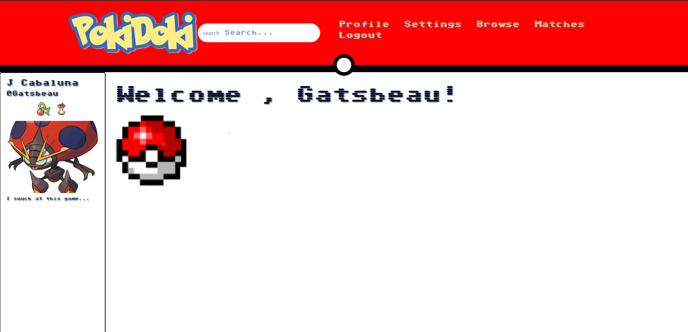
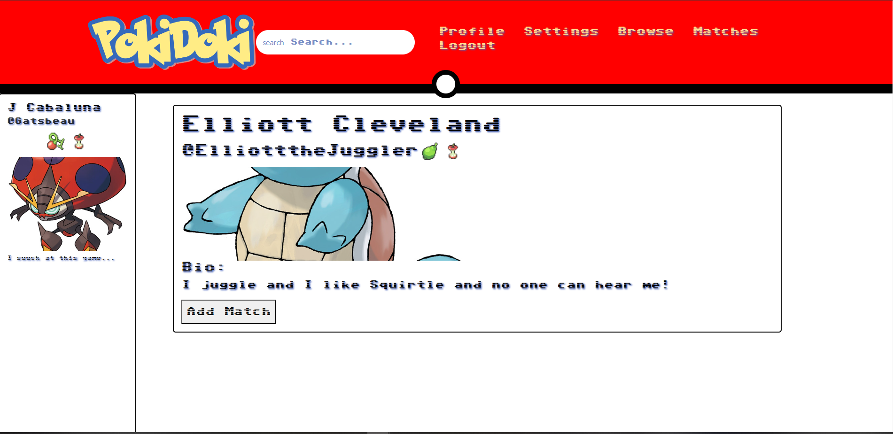

# PokiDoki 
### Jabriel Cabaluna, Jacob Hairfield, Ava Jamora

## Description

An online dating("networking) application for those who like Pokemon! Search for users based on favorite Pokemon and connect with each other via messages with people who want to connect back with you!

### _DISCLAIMER_
This application is a fan-made project and is not affiliated with the
official Pokémon brand, The Pokémon Company, or Nintendo. All Pokémon
content, including images, names, and information, are owned by The
Pokémon Company and Nintendo. This application uses these assets for the
purpose of fan enjoyment and is not intended for commercial use.

## Table of Contents

- [Description](#description)
- [Previews](#previews)
- [Links](#links)
- [License](#license)
- [Questions](#questions)

## Usage 
Once you've created an account, you can search for users based on certain parameters. At the moment, you can only search by species of Pokemon and types (more planned in the future!).  
You can then click on any retrieved profiles and view their account information and send them a match request. Once that match request has been received, you can now message and receive messages from that user.  
You can also edit your current profile to change your displayed information.There is also an option to change the color theme of the website within the Settings tab.

## Previews

## Links

[Link to Application](https://pokidoki-96931dcc8e78.herokuapp.com/)

## License

This project is licensed under [MIT License](https://opensource.org/licenses/MIT). 

## Questions? Suggestions? Contributions?

### Contact any of us below!

J Cabaluna - https://github.com/ChasingGatsby

Jacob Hairfield - https://github.com/lilcobby

Ava Jamora - https://github.com/afj511
